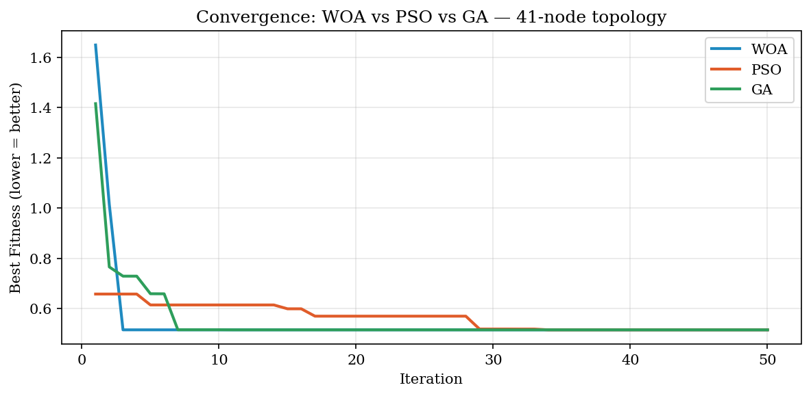
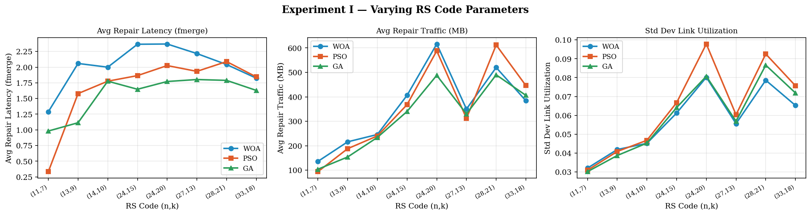
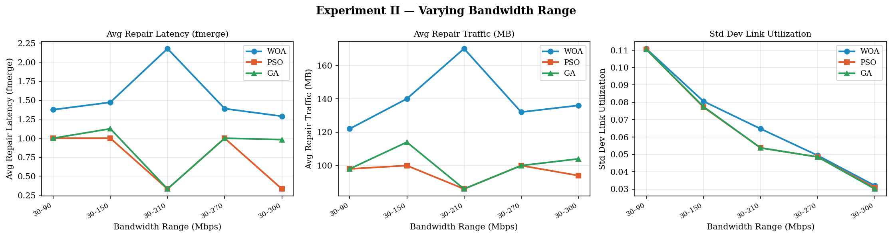
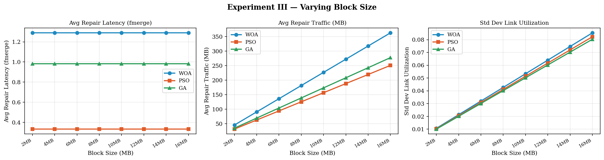

# WOA Repair Optimization for Geo-Distributed Storage
### EECS 247: Information Storage | University of California, Irvine

A comparative study of metaheuristic algorithms (WOA, PSO, GA) for
multi-objective erasure code repair optimization in geo-distributed
data centers.

> Replicating and extending: Xu et al. (2026), *Journal of Cloud
> Computing*, 15(3). https://doi.org/10.1186/s13677-025-00807-z

---

## What This Project Does

When a node fails in a geo-distributed storage system, recovering
erasure-coded data requires retrieving fragments from multiple
data centers — generating network traffic, latency, and load
imbalance. This project implements a **repair tree optimization
framework** that jointly minimizes all three, and benchmarks three
metaheuristic solvers (WOA, PSO, GA) on the same problem to
empirically validate which performs best — a comparison the original
paper never runs.

---

## Key Finding

**No single winner.** Each algorithm has a different strength:

| Metric | Best Algorithm | Result |
|--------|---------------|--------|
| Convergence speed | **WOA** | Stabilizes by iteration 7 vs iteration 28 for PSO |
| Repair latency | **GA** | Lowest fmerge across all (n,k) configs |
| Repair traffic | **PSO** | 20–30% less traffic than WOA consistently |
| Load balancing | All similar | No significant difference |

---

## Repository Structure

```
├── woa_full_experiment.py     # Full WOA vs PSO vs GA implementation
│                              # 41-node topology, all 3 experiments
├── preliminary_woa.py         # Parts 1–5: 8-node test, WOA only
├── results/
│   ├── convergence.png        # WOA vs PSO vs GA convergence curves
│   ├── exp1_nk.png            # Experiment I: varying (n,k)
│   ├── exp2_bandwidth.png     # Experiment II: varying bandwidth
│   └── exp3_blocksize.png     # Experiment III: varying block size
├── proposal/
│   ├── main.tex               # ACM-format proposal (LaTeX)
│   └── Khurd_EECS247_ProjectProposal.docx
├── Khurd_EECS247_Presentation_Final.pptx
└── README.md

```
---

## Results

### Convergence


### Experiment I — Varying RS Code Parameters (n,k)


### Experiment II — Varying Bandwidth Range


### Experiment III — Varying Block Size


---

## How to Run

```bash
pip install matplotlib numpy
python woa_full_experiment.py
```

Change `N_TRIALS = 3` to `N_TRIALS = 10` for final results (takes ~45 min).

Or run instantly on Google Colab — paste the full script into one cell and run.

---

## Experimental Setup

- **Topology**: 41-node US backbone network
- **RS code configs**: (11,7) (13,9) (14,10) (24,15) (24,20) (27,13) (28,21) (33,18)
- **Bandwidth ranges**: 30–90 to 30–300 Mbps
- **Block sizes**: 2–16 MB
- **Trials**: 3 (preliminary) → 10 (final report)
- **Population**: 50 · **Iterations**: 50 per run

---

## Progress

- [x] Graph construction, Dijkstra, loop removal
- [x] Repair tree encoding (leaf-to-root paths)
- [x] Objective functions: fmerge (Eq. 5), fnet-load (Eq. 6), repair traffic
- [x] WOA — contraction, random search, spiral update
- [x] PSO — personal best, global best, inertia decay
- [x] GA — tournament selection, sub-path crossover, Dijkstra mutation
- [x] Experiment I: vary (n,k) across 8 configurations
- [x] Experiment II: vary bandwidth range
- [x] Experiment III: vary block size
- [x] Convergence analysis
- [x] Presentation
- [ ] Final report (Wednesday)

---

## Tech Stack

Python 3.11 · NumPy · Matplotlib

---

## References

1. Xu et al. (2026). *Journal of Cloud Computing*, 15(3).
2. Nadimi-Shahraki et al. (2023). *Arch. Comput. Methods Eng.*, 30(7).
3. Zhang et al. (2017). *IEEE Trans. Parallel Distrib. Syst.*, 28(6).
4. Kennedy & Eberhart (1995). *Proc. ICNN'95*.
5. Holland (1992). *Adaptation in Natural and Artificial Systems*. MIT Press.